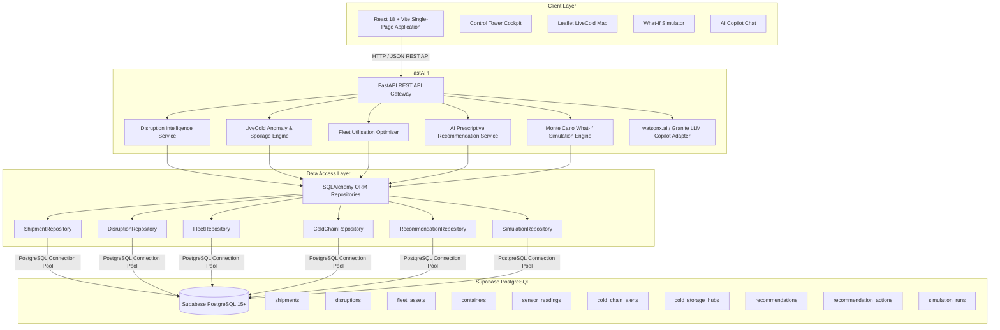

# 🏗️ Technical Architecture — ChainGuard AI

## End-to-End System Diagram

---

## Relational Database Schema (Supabase PostgreSQL)

| Table | Primary Key | Foreign Keys / Description |
|---|---|---|
| `shipments` | `id` (VARCHAR) | `disruption_id`, `carrier_id`, origin/dest coordinates, status, value, risk score |
| `disruptions` | `id` (VARCHAR) | Disruption event name, severity, delay hours, corridor geometry |
| `fleet_assets` | `id` (VARCHAR) | `assigned_shipment_id`, asset type, utilisation %, status, GPS coordinates |
| `containers` | `id` (VARCHAR) | `shipment_id`, `product_id`, target SOP bounds, current/peak temp, spoilage risk |
| `sensor_readings` | `id` (UUID) | `container_id`, timestamp, temp, humidity, anomaly flags (`L1`–`L4`) |
| `cold_chain_alerts`| `id` (VARCHAR) | `container_id`, severity (`CRITICAL`, `MEDIUM`), breach duration, action |
| `cold_storage_hubs`| `id` (VARCHAR) | Hub name, GPS coordinates, available tons, temp zones |
| `recommendations` | `id` (VARCHAR) | `shipment_id`, `disruption_id`, action type, confidence, delay avoided |
| `recommendation_actions` | `id` (UUID) | `recommendation_id`, dispatcher actor, timestamp, previous/new status |
| `simulation_runs` | `id` (UUID) | Scenario parameters, before/after delay, exposure savings |

---

## Security & Isolation Policies
1. **Row Level Security (RLS)**: Public read policies enabled on Supabase PostgreSQL for operational transparency while administrative and mutation operations are restricted via repository layer connections.
2. **Key Isolation**: `SUPABASE_SERVICE_ROLE_KEY` is exclusively consumed by backend services and never exposed to the client bundle.
3. **Environment Segregation**: `.env` files are excluded from version control via `.gitignore`; public `.env.example` templates contain standard placeholders.
